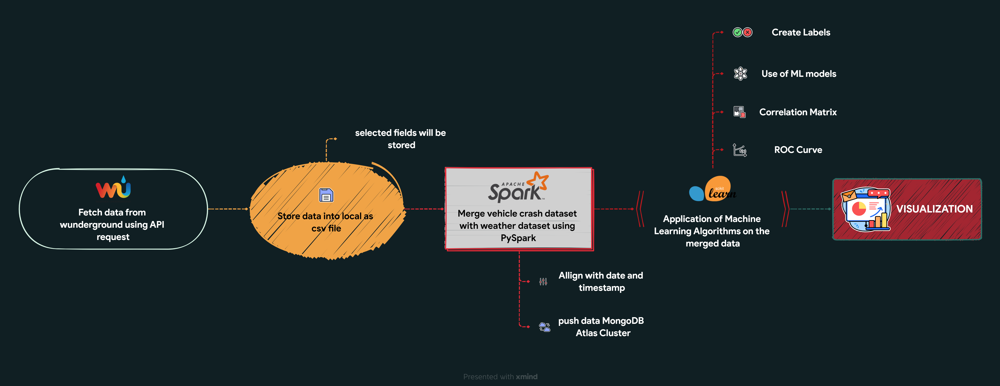

# **Analysis of the relationship between New York City Accidents and Weather**

Traffic crashes have a significant impact on the world economy and are a leading cause of death and injuries worldwide. More than one-half of all traffic deaths globally occur among people ages 15 to 44, their most productive earning years. This project is developed to understand feature correlations, patterns and analyse trends with the current weather conditions in the area of the accident. To develop this system end to end, first we need to extract vehicle crash dataset from the NYC open data website  and web scrape weather data from wunderground website.  Traffic crashes have a significant impact on the world economy and are a leading cause of death and injuries worldwide. 

More than one-half of all traffic deaths globally occur among people ages 15 to 44, their most productive earning years. This project is developed to understand feature correlations, patterns and analyse trends with the current weather conditions in the area of the accident. The data set contains about 2 million records. The next step involves transforming the data set by formatting date and time which is common in both the datasets so that we have familiar data about each incident.  We also scraped weather data from wunderground for each weather station in New York and this data is then processed and mapped with the crash data set.  This data is used for visualization and prediction analysis using machine learning models such logistic regression, Gradient Boosting, to predict the severity of a motor vehicle accident based on 4 classes such as very high, high, medium, low centred on weather and environmental factors such as temperature, precipitation rate, dew, wind speed and high-risk areas that can warn user based on historical data

## *Our project flow is >>*

